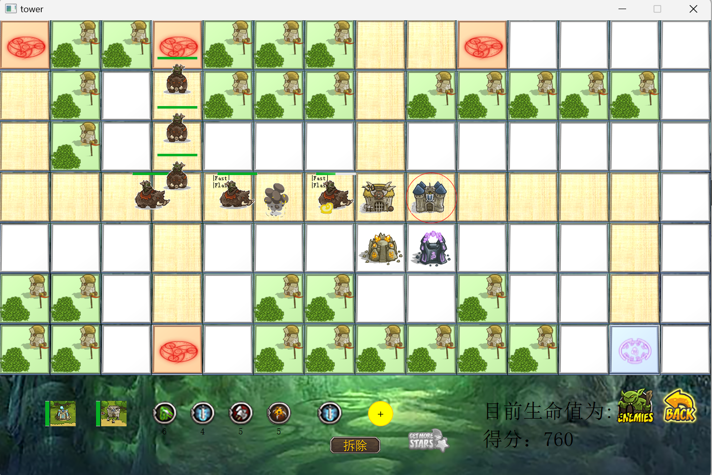

<center><font color=red size=72>Guarding the Dream</font><center>


------


# Introduction:

This is an exceptional game called *Guarding the Dream*, which is a captivating tower defense game similar to *Carrot Fantasy*. Players must construct towers and defend the Dream from being attacked.


The outstanding features of the game can be summarized as follows:

1.  🗺️ The game offers a map selection feature, allowing players to customize the game map according to their preferences.

2.  👻 The game includes both normal and special monsters, with the latter possessing powerful skills.

3.  🗼 There are two types of towers available: short-range towers and long-range towers.

4.  🌿 Each tower can be upgraded up to three levels. With each upgrade, the tower gains increased damage, extended range, and faster attack speed.

5.  💎 The game features four unique stones that can be mounted on the towers. These stones grant the towers additional unexpected abilities.

   

The Cover  of the game:


------


# Latest News：

- [2022/10] Completed the initial concept of the game and developed the map functionality.

- [2022/11/01]   Implemented tower functions, including upgrades, attack range, and construction.

- [2022/11/07] Developed monster-related functions such as movement and head mechanics, including pathing and interactions with towers.

- [2022/11/14] Finalized the implementation of special stones and the unique skills of special monsters.

- [2022/11/28] Resolved bugs related to background music and the visual representation of towers and monsters.

- [2022/12/02] Fixed minor bugs and enhanced the UI design.

- [2022/12/10] Completed all game functionalities.

  S

------


# Details:

Here are some details of the game:

#### Stage one : Map construction.

Users can build the map by themselves. The  game provide five different blocks which are shown as follows: 


**Road Block:** The leftmost block represents the road that monsters can traverse. You can also build short-range towers here to prevent the enemy from advancing.


**Decoration Block:** The block with forests and a windmill serves purely as decoration for the map (just for fun).


**Tower Platform Block:** The white block shown here is a platform where users can build long-range towers to attack the monsters.

 

**Birth Place and Target Place:** The block with a red circle represents the monsters' spawn point, while the rightmost block stands for the Dream that you must defend to prevent enemies from entering.


notice:

You must ensure that the two points (from the birth place to the target place) are connected by a path, or the game will display an error message.


### Stage two : Ready to build your towers.

The image below illustrates the key aspect of the game:


You can build short-range towers on road blocks and long-range towers on tower platform blocks. The picture shows four monster spawn points and one target point. These points are connected by roads consisting of road blocks. We provide two types of towers, each with its own cooldown period.


The details of the tower can be summed up as follows:

| Tower Type                                                 | Description                                                |
| ---------------------------------------------------------- | ---------------------------------------------------------- |
|  (level 1)                | the cheapest short-range tower :   ack=20 ; max_hp=1000    |
|    (level 2)          | Base short-range tower :   ack=30 ; max_hp=1000            |
|  (level 3)            | Highest level short-range tower :   ack=40 ; max_hp=1000   |
|  （level 1)             | the cheapest long-range tower :   ack=10 ; attack-range=1  |
|     (level 2) | Base long-range tower :   ack=15 ; attack-range=2          |
|    (level 3)  | Highest level long-range tower :   ack=20 ; attack-range=3 |


Additionally, we offer four types of magic stones, which will be described in detail below.

| Stones                                                       | Description                                                  |
| ------------------------------------------------------------ | ------------------------------------------------------------ |
|               | Poisonous Arrow:     Enemies hit by this special attack gradually lose health over time. |
|                   | Ice Sword:     Freeze enemies for several seconds.           |
|           | Rampage axe:     Increase the attack speed of the tower.     |
|  | Area of effect Heart:     enable the tower can attack many enemies at the same time. |

Users can install two magic stones on the one tower which will enable tower to  perform different effects.  Whenever a monster is killed, it will randomly drop a gem.

------

The "GET MORE STARS" button is used to upgrade towers. Users can spend their scores to build new towers and earn additional scores by defeating monsters.


### Stage three: Combat and defend your dream.

Now  the game has four type monsters :

| Enemy Type                                                   | Description                                                  |
| ------------------------------------------------------------ | ------------------------------------------------------------ |
| (normal)        | the normal monster which has no skills                       |
|        (fast)         | the speed of the enemy is fast than others                   |
| (flash)                 | This type of monster can skip one  short-range tower         |
| (flash & fast) | This monster possesses the two powerful skills mentioned above. |


Here is a picture which shows the process of the game:




------


# Requirements

- qt-opensource-windows-x86-5.12.12  ,click here to  [download](https://www.qt.io/blog/qt-5.12.12-released).
- Windows 11 


------


# How to get:

Clone the repo and  open the tower.pro using Qt,  build the product and run the program.


------


# Fixed Issues:

If you add a large source file into the Qt program, you might meet this issue:

```
error: [Makefile.Release:2396: release/qrc_res.o] Error 1
```

According to [this](https://blog.csdn.net/Fuel_Ming/article/details/120949777) , I solve the problem.


------


# Videos:

```html
<video src=“https://www.bilibili.com/video/BV1F23zeNES8/?vd_source=4985f83853fea5fcd090f8f95973265a”></video>
```


------


## Future Work：

1. Changing from a single process to multiple processes :   increase the smoothness of the game.
2. Beautify the UI.
3. Fix some invisible bugs.
